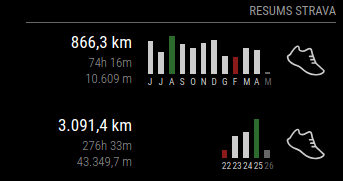

# MagicMirror Module: MMM-Strava (modificat)

Fork del mòdul original [MMM-Strava](https://github.com/ianperrin/MMM-Strava) d'ianperrin per a [MagicMirror²](https://MagicMirror.builders), amb millores visuals al mode `chart`.

[](https://MagicMirror.builders)
[](https://raw.githubusercontent.com/ianperrin/MMM-Strava/master/LICENSE)

---

## Novetats respecte a la versió original

### 1. Colors dinàmics al gràfic de barres

En mode `chart` amb `chartType: "bar"`, el gràfic destaca automàticament:

- 🟢 **Verd fosc** — la barra amb més distància del període
- 🔴 **Vermell** — la barra amb menys distància del període

Els colors s'apliquen únicament sobre els intervals **passats**, excloent el mes/dia actual i els futurs.

### 2. Gràfic anual amb els últims 12 mesos

En mode `chart` amb `period: "ytd"`, el gràfic mostra sempre els **últims 12 mesos complets** en ordre cronològic, amb el mes actual sempre a l'última posició a la dreta.

Per exemple, amb **maig de 2026** com a mes actual:

```
J  J  A  S  O  N  D  G  F  M  A  M
↑                                  ↑
juny 2025                  maig 2026 (actual)
```

En canviar de mes, el gràfic es desplaça automàticament per mostrar sempre la finestra dels últims 12 mesos.

---

## Exemple



El mòdul mostra informació d'activitats en dos modes:

- **Mode `table`**: mostra una taula amb el nombre d'activitats, la distància total i (per al període `recent`) el nombre d'assoliments.
- **Mode `chart`**: mostra la distància total, el temps en moviment i el desnivell, juntament amb un gràfic de barres que agrupa la distància per:
  - dia (per al període `recent`)
  - mes — últims 12 mesos (per al període `ytd`) ⭐ **millorat**
  - any (per al període `all`)

---

## Instal·lació

1. Atura el MagicMirror i clona el repositori a la carpeta de mòduls:

   ```bash
   cd ~/MagicMirror/modules
   git clone https://github.com/doobmarley/MMM-Strava.git
   cd ~/MagicMirror/modules/MMM-Strava
   npm install --production
   ```

2. Crea una aplicació a l'API de Strava i anota el `client_id` i el `client_secret`:

   - Ves a [My API Application](https://www.strava.com/settings/api) i inicia sessió a Strava.
   - Assegura't que el domini de callback coincideix amb la IP o URL del MagicMirror.
   - Anota el `client_id` i el `client_secret`.

3. Afegeix el mòdul al fitxer de configuració (`~/MagicMirror/config/config.js`):

   ```javascript
   modules: [
     {
       module: "MMM-Strava",
       position: "top_right",
       config: {
         client_id: "el_teu_strava_client_id",
         client_secret: "el_teu_strava_client_secret",
         mode: "chart",
         period: "ytd"
       }
     }
   ];
   ```

4. Reinicia el MagicMirror:

   ```bash
   cd ~/MagicMirror && npm start
   ```

5. Autentica el mòdul per permetre l'accés a l'API de Strava:

   - Ves a [http://localhost:8080/MMM-Strava/auth/](http://localhost:8080/MMM-Strava/auth/)
   - Selecciona el mòdul i fes clic a *Authorise*.
   - A la pàgina d'autorització de Strava, selecciona el nivell d'accés i fes clic a *Authorize*.
   - Un cop aparegui el missatge d'èxit, reinicia el MagicMirror.

---

## Opcions de configuració

| **Opció** | **Per defecte** | **Descripció** | **Valors possibles** |
| --- | --- | --- | --- |
| `client_id` | | *Obligatori* — L'ID de client de la teva aplicació Strava. | |
| `client_secret` | | *Obligatori* — El secret de client de la teva aplicació Strava. | |
| `mode` | `table` | *Opcional* — Mode de visualització. | `"table"`, `"chart"` |
| `chartType` | `bar` | *Opcional* — Tipus de gràfic en mode `chart`. | `"bar"`, `"radial"` |
| `activities` | `["ride", "run", "swim"]` | *Opcional* — Activitats a mostrar i el seu ordre. | `"ride"`, `"run"`, `"swim"`, `"hike"`, `"walk"`, `"virtualride"`, i moltes més |
| `period` | `recent` | *Opcional* — Període de les estadístiques. | `"recent"` = setmana actual, `"ytd"` = últims 12 mesos ⭐, `"all"` = tot el temps |
| `stats` | `["count", "distance", "achievements"]` en `table` / `["distance", "moving_time", "elevation"]` en `chart` | *Opcional* — Estadístiques a mostrar. | `"count"`, `"distance"`, `"elevation"`, `"moving_time"`, `"elapsed_time"`, `"achievements"` |
| `auto_rotate` | `false` | *Opcional* — Rotació automàtica entre períodes (només mode `table`). | `true`, `false` |
| `units` | `config.units` | *Opcional* — Unitats de distància i elevació. | `"metric"` = km/m, `"imperial"` = milles/peus |
| `updateInterval` | `10000` (10 segons) | *Opcional* — Interval entre rotacions de període (mil·lisegons). | `1000` - `86400000` |
| `reloadInterval` | `300000` (5 minuts) | *Opcional* — Interval de recàrrega de dades de l'API (mil·lisegons). | `7500` - `86400000` |
| `animationSpeed` | `2500` | *Opcional* — Velocitat de l'animació de transició (mil·lisegons). | `0` - `5000` |
| `locale` | `config.language` | *Opcional* — Idioma per a les etiquetes de dates al gràfic. | `"ca"`, `"es"`, `"en"`, `"fr"`, etc. |
| `digits` | `1` | *Opcional* — Decimals per a les estadístiques de distància i elevació. | `0`, `1`, `2`... |
| `firstYear` | *Cinc anys abans de l'any actual* | *Opcional* — Primer any a mostrar en mode `chart` amb `period: "all"`. | Any en format numèric |
| `debug` | `false` | *Opcional* — Activa el registre extès a la consola. | `true`, `false` |

---

## Fitxers modificats

| Fitxer | Canvis |
| --- | --- |
| `MMM-Strava.js` | Nou filtre `getBarHighlightClass` per als colors dinàmics. Actualització de `getIntervalClass`, `getLabel` i `getBarHighlightClass` per al mode rotatori de 12 mesos en `ytd`. |
| `node_helper.js` | Canvi de la finestra temporal del mode `ytd` (últims 12 mesos). Nova lògica d'assignació d'activitats als intervals basada en diferència de mesos. |
| `MMM-Strava.css` | Noves regles CSS per als colors `bar-best` (verd fosc) i `bar-worst` (vermell) amb especificitat suficient per sobreescriure els estils originals. |
| `templates/MMM-Strava.chart.njk` | Aplicació del filtre `getBarHighlightClass` a cada barra del gràfic SVG. |

---

## Crèdits

- Mòdul original: [ianperrin/MMM-Strava](https://github.com/ianperrin/MMM-Strava)
- Millores: colors dinàmics i gràfic rotatori dels últims 12 mesos.

## Llicència

MIT
